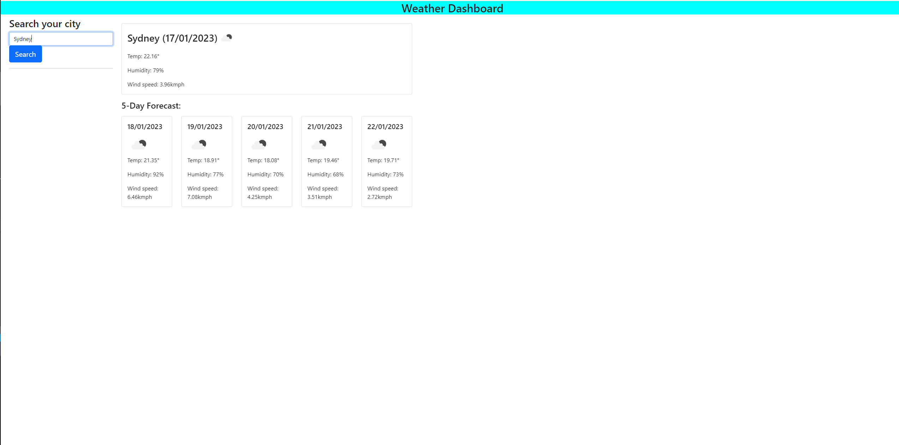

for this project the aim was to createa webpage which will read data from the open weather API

This application takes the text input data by the user from the form and displays the weather for the city chosen

the weather information with a large card displaying the currents days information and also 5 small cards with information on the next 5 days

future developments of this webpage will include:
- adding the searched cities into local storage
- having thise searched cities appear on the page as clickable links to be able to quick search the cities. 

Deployed webpage: https://mbosse97.github.io/city-weather-dashboard/ 

Webpage screenshot:

